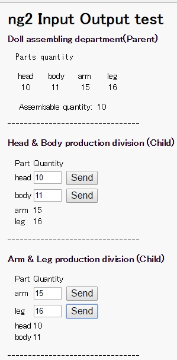

#Test Angular2 Dart @Input @Output

## How to run
1. step0
  * get dart SDK
  * get dartium
2. step1
  * pub get
  * pub serve
3. step2
  * set http://localhost:8080/ to browser
4. step3
  * click **Send** buttons
5. snapshot
  * 
